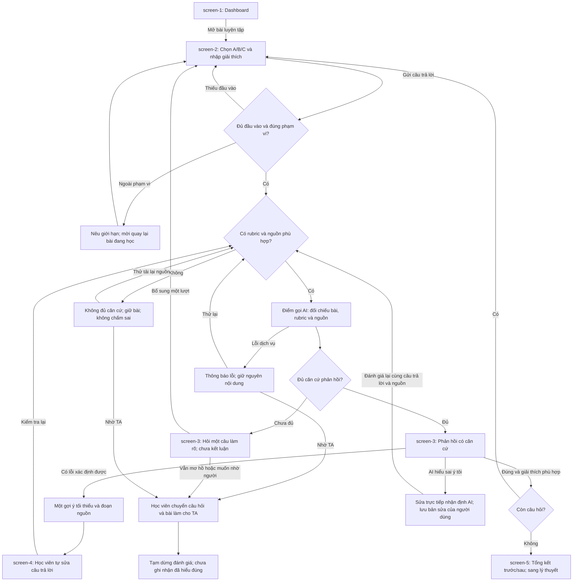

# AI SPEC — Học từ lỗi trước · K4-3B-E402-AIGAN

**Lớp:** 3B · **Phòng:** E402 · **Cụm:** B2 · **Track:** D2 — Học tập thích ứng và tương tác.
**Loại:** Tính năng mới trên VLearn · **Prototype:** có tích hợp Working; ba workflow chính được báo cáo ở CP3, chưa tái lập đầy đủ trên commit khôi phục.
**Mốc chốt spec theo rubric lớp 3B:** 21:00 ngày 18/09/2026 tại CP4. Giữ nguyên quality bar ở §7; đã kiểm tra bar có ở `f368a51` (17/09 20:37) và được ghi chốt ở `20faf8c` (18/09 14:22), trước hạn theo metadata Git; chưa có biên nhận nộp; kết quả CP3/CP4 hiện được ghi ở [eval/cp3-test-results.md](eval/cp3-test-results.md).
> **Bản cập nhật 19/09/2026, code tham chiếu `015eb88`.** §6 là thiết kế đích; các nhánh chưa có được ghi trong cột hiện trạng.

## §1. User & Job

- **Track + đề:** D — Học tập thích ứng và tương tác · D2 — Học từ lỗi trước: làm bài rồi mới được giảng.
- **Job executor:** Học viên trên VLearn đang bắt đầu học một khái niệm AI/LLM mới, vừa trả lời một bài luyện tập không tính điểm trước khi xem lý thuyết và cần tự sửa cách hiểu.
- **Workflow của lát cắt:** Làm bài ngắn trước khi xem lý thuyết → gửi câu trả lời → nhận một gợi ý tối thiểu kèm nguồn nếu đủ căn cứ, hoặc câu hỏi làm rõ nếu chưa đủ → tự sửa và thử lại.
- **Core JTBD:** Khi vừa làm sai một bài về khái niệm mới, tôi muốn biết mình vướng ở đâu và có một gợi ý vừa đủ để tự sửa, để có thể giải thích được cách làm thay vì chỉ làm theo hoặc đoán đáp án.
- **Problem statement:** Khi làm sai bài về khái niệm mới, học viên nhận đáp án hoặc lời giải chung nhưng không biết mình sai ở đâu để tự sửa, nên có thể làm theo hoặc đoán ra đáp án mà vẫn chưa giải thích được cách làm.

**Evidence — đối chiếu CSV gốc trong `data/`, cập nhật từ [Canvas CP1](canvas-cp1.md):**

Bản CSV ngày **17/09/2026** có **62 phản hồi**, trong đó **33 phản hồi chọn đã làm bài** (30 trên VLearn, 3 ở nền tảng khác/trên lớp). Đơn vị đếm là phản hồi, chưa xác minh người trả lời duy nhất. Bản này cập nhật số liệu 60/31 trong canvas.

| Chỉ số | Kết quả | Cách đếm theo bản tổng hợp trong canvas |
|---|---|---|
| Từng bị kẹt hoặc làm sai mà chưa biết cách sửa ít nhất một lần | **22/33 (66,7%)** | Trong nhóm 33 phản hồi đã làm bài, đếm người báo gặp khó ít nhất một lần; mỗi phản hồi tính một lần. |
| Kết thúc lần gặp khó nhưng chưa tự giải thích được cách làm hoặc chưa hoàn thành | **21/33 (63,6%)** | Trong nhóm 33 phản hồi đã làm bài, đếm người thuộc ít nhất một kết quả: làm theo lời giải nhưng chưa giải thích được; đoán/thử ra đáp án; vẫn sai/bỏ dở. Mỗi phản hồi tính một lần. |

**Nguồn:** [Bộ khảo sát học viên](https://docs.google.com/spreadsheets/d/1Q_rLGeWkkA9s0omhXd0yBIbu8OPJ4YrzpNZBHbc0dHM/edit?gid=1262249386#gid=1262249386). Hai chỉ số mô tả các khía cạnh khác nhau, có thể trùng người trả lời; không cộng thành tổng số người gặp vấn đề.

**5 ví dụ trả lời nguyên văn:** Đây là lựa chọn có sẵn trong biểu mẫu, không phải quote phỏng vấn tự do. Câu 4 chỉ có một nội dung “mình không nhớ” tại R62, không đủ 5 lời kể trải nghiệm.

| Mã bản ghi | Câu hỏi | Lựa chọn nguyên văn |
|---|---|---|
| R3 | Q5 | Không hiểu vì sao cách làm của mình sai |
| R4 | Q5 | Không biết mình sai ở bước nào |
| R6 | Q9 | Vẫn làm sai hoặc bỏ dở |
| R7 | Q9 | Làm theo lời giải nhưng chưa giải thích được vì sao |
| R11 | Q9 | Có đáp án đúng nhưng chủ yếu nhờ đoán/thử |

Nguồn: tệp CSV duy nhất trong `data/`, tên bắt đầu “Khảo sát trải nghiệm làm bài và sửa lỗi khi học AI”. Rn là thứ tự bản ghi CSV cộng 1 dòng tiêu đề, không phải số dòng văn bản khi ô có xuống dòng. Qn là số câu hỏi của biểu mẫu. Cách tái đếm: lọc Q1 khác “Chưa làm bài tập”; Q3 cộng “1–2 lần” (10), “3–5 lần” (7), “Trên 5 lần” (5) = 22; Q9 cộng làm theo lời giải (11), đoán/thử (6), sai/bỏ dở (4) = 21. Giữ câu trả lời “không nhớ” trong mẫu số 33. Không suy rộng thành tỷ lệ của toàn khóa; dữ liệu tự khai có bất nhất giữa các câu trả lời.

## §2. Impact & quyết định chọn

**Ứng viên được chọn:** Hỗ trợ học viên tự sửa cách hiểu sau khi làm bài trước lý thuyết, bằng phản hồi có căn cứ và gợi ý tối thiểu.

Bảng dưới là phân tích ưu tiên cho spec, không phải biên bản về các phương án nhóm từng thử. Tỷ lệ dùng cùng nhóm 33 phản hồi đã làm bài; các nhóm có thể trùng nhau.

| Ứng viên | Bao nhiêu người | Tần suất | Tốn gì mỗi lần | Khả thi / quyết định |
|---|---|---|---|---|
| Gợi ý theo lỗi để tự sửa | Q3: 22/33 từng bị kẹt; Q9: 21/33 chưa giải thích được hoặc chưa hoàn thành | Q3: 10 người 1–2 lần, 7 người 3–5 lần, 5 người trên 5 lần trong “những ngày qua” | Q8: 8/33 mất ít nhất 16 phút; 3/33 cuối cùng chưa tự sửa được. Đây là chi phí gặp khó chung, chưa quy nguyên nhân cho riêng ứng viên. | **Chọn:** phù hợp D2; prototype hiện có 6 câu cố định, golden set gốc dựa trên 2 câu của mock CP2. |
| Tìm đúng đoạn bài giảng | Q11 về tìm tài liệu: 15/33 (45,5%) gặp ít nhất một lần | 8 người 1–2 lần; 7 người ≥3 lần trong 14 ngày | Tốn công tìm nguồn; chưa đo thời gian riêng | **Không chọn làm sản phẩm độc lập:** truy xuất là phần hỗ trợ cho gợi ý, chưa giải quyết việc học viên tự giải thích lại. |
| Nhắc ôn để tránh lặp lỗi | Q11 về lặp lỗi: 17/33 (51,5%) gặp ít nhất một lần | 6 người 1–2 lần; 11 người ≥3 lần trong 14 ngày | Làm lại lỗi cũ; chưa định lượng thời gian | **Để backlog:** cần lịch sử nhiều bài và theo dõi qua thời gian, cần theo dõi qua nhiều phiên; dù bản hiện tại có lịch sử local, chưa đo được hiệu quả giảm lặp lỗi. |
**Lý do chọn bằng số:** Tỷ lệ **66,7% (22/33)** cho thấy khó khăn tự sửa xuất hiện trong nhóm đã thực sự làm bài; tỷ lệ **63,6% (21/33)** cho thấy việc vượt qua lần gặp khó chưa luôn đi kèm khả năng giải thích cách làm hoặc hoàn thành bài. Đây là cơ sở ưu tiên hỗ trợ tự sửa; các số liệu chưa chứng minh hiệu quả của giải pháp.

**Lát cắt triển khai:** Học viên vừa trả lời một bài về khái niệm AI/LLM trước khi xem lý thuyết, cần tự sửa cách hiểu · AI quyết định **đủ / chưa đủ căn cứ để đưa gợi ý** dựa trên câu trả lời, rubric và tài liệu · kết quả là phản hồi giúp học viên thử lại, gồm một gợi ý tối thiểu kèm nguồn nếu đủ căn cứ hoặc câu hỏi làm rõ nếu chưa đủ.

**Giới hạn để triển khai:** Tự động hóa có điều kiện; khi câu trả lời mơ hồ, lỗi ngoài danh mục lỗi hiểu sai hoặc thiếu nguồn, AI nêu chưa đủ căn cứ và hỏi lại, không tự kết luận học viên hiểu sai. Lý do: phản hồi sai có thể củng cố cách hiểu sai của học viên.

**Người sẵn sàng thử theo canvas:** Vũ Quốc Huy, Nguyễn Quốc Cường, Hà Thị Mỹ Linh.

**Giới hạn quyết định:** Các chỉ số đo những câu hỏi và khoảng thời gian khác nhau; không dùng chênh lệch tỷ lệ làm bằng chứng ưu thế nhân quả. Chọn theo cả pain, phạm vi D2 và khả năng kiểm tra trong hackathon.

## §3. Giải pháp tương tự đã nghiên cứu

Bảng dưới kế thừa phần tham khảo trong spec ngày 17/09. Nhóm chưa có nhật ký dùng thử hai sản phẩm; các khác biệt là định hướng thiết kế, chưa phải kết quả so sánh thực nghiệm.

| Giải pháp | Luồng theo tài liệu chính thức | Đáng học | Đáng né khi áp dụng / mình khác gì |
|---|---|---|---|
| [Khanmigo — Khan Academy](https://www.khanacademy.org/khan-labs) | Gia sư hỗ trợ người học từng bước để tự tìm ra lời giải. | Dùng câu hỏi gợi mở và để người học thực hiện bước tiếp theo. | Tránh kéo dài hội thoại mà không có điểm dừng. D2 giới hạn một bài, một gợi ý, một lượt làm rõ rồi cho nhờ TA; cần kiểm tra bằng thử nghiệm. |
| [ChatGPT Study Mode](https://openai.com/index/chatgpt-study-mode/) | Hỏi mục tiêu/trình độ, hướng dẫn bằng câu hỏi, gợi ý và kiểm tra hiểu biết. | Điều chỉnh hỗ trợ theo suy luận và yêu cầu người học giải thích lại. | [Tài liệu trợ giúp](https://help.openai.com/en/articles/11780217) nêu đôi lúc vẫn có thể đưa đáp án trực tiếp. D2 thiết kế cổng rubric/nguồn, phản hồi giới hạn và tổng kết trước/sau cho hai khái niệm cụ thể. |

Không coi việc có gợi ý là bằng chứng cải thiện học tập; phải đo khả năng tự giải thích và áp dụng sang câu tương đương trong validation.
## §4. Thiết kế

### §4a. Phạm vi, prototype và tự động hóa

**Lát cắt MỘT CÂU:** Học viên vừa trả lời một bài về khái niệm AI/LLM trước khi xem lý thuyết, cần tự sửa cách hiểu · AI quyết định **đủ / chưa đủ căn cứ để đưa gợi ý** dựa trên câu trả lời, rubric và tài liệu · kết quả là một phản hồi giúp học viên thử lại: gợi ý tối thiểu kèm nguồn khi đủ căn cứ hoặc yêu cầu làm rõ khi chưa đủ.

**Artifact hiện hành:** [backend và hướng dẫn chạy](codebase/README.md), giao diện được FastAPI ghép từ `templates/`, logic đánh giá tại `ai_service.py`. Bộ bài có 6 câu: 3 tự luận và 3 trắc nghiệm. Các đường dẫn `cp2-flow.html` trong tài liệu lịch sử không còn là entrypoint hiện hành.

**Non-goals:**

- Không sinh đề tự động; dùng 6 câu cố định từ `content/lesson.json`.
- Không chấm điểm chính thức hoặc kết luận năng lực tổng thể.
- Không trả ngay đáp án để chép; sau ba lỗi có nỗ lực, policy có thể mở đáp án kèm căn cứ để hỗ trợ học tiếp.
- Không hỗ trợ kiến thức ngoài phạm vi RAG/context và tài liệu truy xuất được.
- Không tích hợp tài khoản/hồ sơ, mở khóa bài hoặc streak của nền tảng VLearn thật. Có đăng nhập local và lịch sử SQLite phục vụ prototype.

**Mức prototype:** Working prototype theo cấu trúc HTTP/UI/SQLite và tích hợp LLM trong mã. Bản kiểm tra ngày 19/09 chạy 5 test policy local; chưa chạy UI hoặc model thật, chưa chứng nhận end-to-end. Test policy không thay cho trace live.

| Thành phần | Triển khai hiện hành và giới hạn |
|---|---|
| Nội dung | `lesson.json` chứa câu hỏi và đáp án MCQ; không chứa nguồn/rubric kiến thức cố định. |
| Grounding | `knowledge_base.py` đọc transcript local, BM25 lấy tối đa 12 đoạn; model sinh rubric tạm từ nguồn. Validator chỉ nhận citation ID thuộc tập đã truy xuất. Không bảo đảm mọi suy luận của model đúng. |
| Bài làm | `/api/analyze` nhận initial/retry/transfer, lưu attempt và lịch sử local; request ID hỗ trợ chống ghi trùng. |
| Correction G9 | Chưa có workflow correction như thiết kế. Schema không nhận `stage=correction`; không khai đã lưu bản cũ/bản sửa. |
| Làm rõ/TA | Có nhánh CLARIFY; chưa xác minh cơ chế giới hạn lượt hỏi lại. Recovery panel và tải JSON chuyển TA chưa có trong bản khôi phục. |
| Failure | Backend có lỗi thiếu nguồn/dịch vụ và validation output; chưa kiểm chứng giữ bài/retry trên UI. Không có recovery panel hoặc bộ fault test bổ sung ở bản khôi phục. |
| Đo lường | Chưa có người dùng prototype thật; không dùng trạng thái demo làm bằng chứng hiệu quả học tập. |

**Automation:** [ ] Augment · [x] Conditional · [ ] Automate.

**Lý do theo cost-of-error:** Nếu AI gán sai ngộ nhận hoặc báo đúng khi học viên vẫn hiểu sai, học viên chịu thiệt hại do củng cố kiến thức sai và mang lỗi sang bài sau; học viên mới khó tự phát hiện, còn TA phải đọc lại bài và giải thích lại để sửa. Ngược lại, hỏi thêm một câu khi chưa chắc chỉ khiến học viên thêm một lượt nhập. Vì vậy, hệ thống chỉ tự phản hồi khi câu trả lời rõ, rubric và đoạn nguồn phù hợp, không mâu thuẫn; trường hợp thiếu căn cứ hoặc vẫn mơ hồ sau một lượt làm rõ phải dừng kết luận và để học viên chuyển nội dung cho TA. Không dùng mức Automate vì lỗi kiến thức không dễ tự thấy và tự sửa; không bắt TA duyệt từng phản hồi có căn cứ trong bài luyện tập không tính điểm. Báo cáo 16/16 là lịch sử CP3; kết quả hiện hành và giới hạn nằm tại eval/current-results.md.

**Điểm quyết định theo mã:** Backend kiểm tra phiên và đầu vào, truy xuất transcript trước khi gọi model, rồi validate schema/citation và đối chiếu lựa chọn với suy luận. Kết quả có thể là VERIFY/DIAGNOSE/CLARIFY/DECLINE. Nguồn rỗng bị chặn bằng lỗi dịch vụ thay vì chấm sai người học; chưa kiểm chứng toàn bộ hành vi UI. Phạm vi kiểm tra tại [báo cáo hiện hành](eval/current-results.md).

### §4b. Nguyên tắc HAX và vị trí áp dụng

| Nguyên tắc | Áp cụ thể vào đâu trong prototype | Hiện trạng / cách kiểm tra |
|---|---|---|
| [G1 — Nêu rõ hệ thống làm được gì](https://www.microsoft.com/en-us/haxtoolkit/guideline/make-clear-what-the-system-can-do/) | `screen-2`: mô tả bài luyện tập không tính điểm, ô giải thích và khối “Quyết định AI có điều kiện” nêu đủ căn cứ thì gợi ý, chưa đủ thì hỏi lại. | Đã có nội dung trong UI working slice; đọc trước khi gửi bài để biết phạm vi hỗ trợ. |
| [G10 — Thu hẹp phạm vi khi nghi ngờ](https://www.microsoft.com/en-us/haxtoolkit/guideline/scope-services-when-in-doubt/) **(bắt buộc)** | `screen-3` / `ai-result-insufficient`: không kết luận ngộ nhận, yêu cầu bổ sung giải thích; §6 thêm nhánh dừng khi thiếu nguồn và chuyển TA khi vẫn mơ hồ. | `clarify-text` lấy câu làm rõ từ backend. Giới hạn một lượt làm rõ và chuyển TA là yêu cầu chưa chứng minh. |
| [G11 — Giải thích vì sao có phản hồi](https://www.microsoft.com/en-us/haxtoolkit/guideline/make-clear-why-the-system-did-what-it-did/) | `screen-3`: `wrong-user-summary`, `minimal-hint-text`, `hint-source-text` giải thích lỗi được nhận diện và căn cứ; nhánh mơ hồ giải thích vì sao chưa kết luận. | Có code render citation; chưa kiểm tra UI/model thật trong lượt rà này. |
| G9 — Cho phép sửa dễ dàng | Thiết kế đích: sửa nhận định tại thẻ phản hồi rồi đánh giá lại. | Chưa triển khai ở `015eb88`; G9 chưa đủ bằng chứng để nhận điểm mapping vào prototype. |

## §5. Kiểu lỗi — bốn lớp chỗ khó

| Mã | Lớp | Kịch bản | Ai chịu hậu quả | Hành vi yêu cầu / cách kiểm tra |
|---|---|---|---|---|
| E01 | ① Thiếu căn cứ | Không có đoạn nguồn | Học viên học sai nếu AI bịa | Dừng kết luận; thử lại/TA; GS07. |
| E02 | ① Thiếu căn cứ | Rubric và nguồn mâu thuẫn | Học viên bị chấm sai | Nêu xung đột, chuyển TA; GS08. |
| E03 | ① Thiếu căn cứ | Citation chỉ là tên tài liệu, không có đoạn hỗ trợ | Học viên không kiểm chứng được | Không phát hành phản hồi có vẻ đã có căn cứ; GS09. |
| E04 | ② Mơ hồ | Trống, ngắn hoặc nói chọn bừa | Bị gán ngộ nhận vô căn cứ | Yêu cầu đầu vào/làm rõ, không chấm đúng; GS11–13. |
| E05 | ② Mơ hồ | Đã bổ sung một lượt nhưng vẫn không rõ | Học viên mắc vòng lặp | Cho nhờ TA/tạm dừng; GS14. |
| E06 | ③ Ngoài phạm vi | Xin đáp án, yêu cầu bỏ rubric | Mất mục tiêu tự sửa | Nêu phạm vi, chỉ gợi ý; GS15–16. |
| E07 | ③ Ngoài phạm vi | Hỏi chủ đề khác | Nhận phản hồi không liên quan | Quay về bài đang học; GS17. |
| E08 | ④ Học tập | Đáp án đúng nhưng giải thích sai | Củng cố hiểu sai | Hỏi lại mâu thuẫn, không xác nhận đã hiểu; GS18. |
| E09 | ④ Học tập | Đáp án sai nhưng giải thích đúng | Chẩn đoán nhầm | Hỏi xác nhận lựa chọn; GS19. |
| E10 | ④ Học tập | Sửa trống hoặc vẫn sai nhưng hệ thống báo đúng | Học viên qua bài khi chưa hiểu | Không hoàn thành; kiểm tra lại theo rubric; GS20–21. |
| E11 | ④ Quyền sửa | AI hiểu sai ý, người học phản bác | Mất niềm tin, giữ nhãn sai | Cho sửa trực tiếp nhận định và đánh giá lại; GS22. |
| E12 | ① Lỗi dịch vụ | Timeout hoặc output không hợp lệ | Mất bài làm, hiểu nhầm là làm sai | Giữ dữ liệu, báo lỗi, thử lại; GS10. |

Độ ưu tiên cao nhất: bịa căn cứ, chấp nhận bài sửa sai, bỏ qua correction. Các lỗi này chặn nghiệm thu bất kể tỷ lệ tổng thể.
## §6. Bốn đường đi của trải nghiệm

### Hành trình tổng thể

Sơ đồ dưới đây mô tả bốn đường đi. Đây là thiết kế đích, không khẳng định mọi nhánh đã có ở `015eb88`; đối chiếu cột cuối bảng dưới và báo cáo hiện hành.

### Chi tiết bốn đường đi

| Đường đi | Điều kiện vào | Người dùng thấy / làm | Đầu ra và điểm kết thúc | Đối chiếu codebase |
|---|---|---|---|---|
| **Happy path — đủ căn cứ** | Giải thích rõ, có rubric và nguồn hỗ trợ; nhận định không mâu thuẫn với bài làm. | Từ Dashboard vào bài, chọn đáp án và nhập giải thích. Nếu đúng và giải thích phù hợp: xem phản hồi củng cố; nếu có lỗi: nhận một gợi ý kèm nguồn → “Tôi đã nhận ra! Thử sửa lại” → nhập cách hiểu mới → kiểm tra lại. | Chỉ xác nhận đúng khi bài sửa đáp ứng rubric; nếu chưa đúng, tiếp tục gợi ý hoặc hỏi lại. Khi hoàn thành các câu đã chọn, xem tổng kết và sang lý thuyết; tính đúng của tổng kết cần kiểm thử riêng. | Có code VERIFY/DIAGNOSE; kết quả 18/09 là lịch sử. GS18 có lệch kỳ vọng cần rà lại; chưa chạy lại trên commit khôi phục. |
| **Low-confidence — lớp ②** | Có nguồn nhưng giải thích ngắn, mơ hồ, đoán đáp án hoặc không rõ suy luận. | Hiện “Chưa đủ căn cứ để xác định bạn đang vướng ở đâu”, hỏi một điểm cụ thể; nút “Quay lại bổ sung thêm giải thích” giữ bài để sửa. Sau một lượt làm rõ vẫn mơ hồ, cho chọn nhờ TA hoặc tạm dừng. | Gửi lại qua điểm quyết định; không gán ngộ nhận, không xác nhận hiểu đúng khi chưa đủ căn cứ. | Có CLARIFY; chưa chứng minh giới hạn số lượt và chuyển TA như thiết kế. |
| **Failure / no-grounding — lớp ①** | Không tìm được đoạn nguồn phù hợp, rubric thiếu/mâu thuẫn; hoặc gọi dịch vụ thất bại. | Với thiếu nguồn: “Chưa tìm thấy căn cứ phù hợp cho bài này”; với lỗi dịch vụ: “Chưa kiểm tra được, bài làm của bạn được giữ lại”. Có “Thử lại” và “Nhờ TA”; không tạo citation hoặc suy đoán đáp án. | Thử lại từ kiểm tra nguồn; nếu không khôi phục được thì tạm dừng đánh giá. Khi học viên chọn nhờ TA, chuẩn bị câu hỏi, bài làm và lý do dừng để họ tự chuyển; không tự gửi. | Có guard thiếu nguồn/lỗi dịch vụ trong mã; chưa chạy fault test GS07–10. Chưa chứng minh xử lý rubric mâu thuẫn. |
| **Correction — người dùng sửa kết quả AI** | AI tóm tắt sai ý hoặc gán sai ngộ nhận, dù người dùng đã giải thích rõ. | Tại thẻ phản hồi, bấm “AI hiểu sai ý tôi” → sửa trực tiếp đoạn nhận định → “Đánh giá lại”; giữ nguyên câu hỏi, bài làm, phản hồi cũ và bản sửa để đối chiếu. | Đánh dấu bản sửa là ý kiến người dùng, chưa phải kết luận đã kiểm chứng; đánh giá lại với rubric/nguồn. Nếu vẫn bất đồng, nhờ TA hoặc tạm dừng. | Chưa có dialog/API correction ở commit khôi phục; GS22 chưa được nghiệm thu. |

### Ngoại lệ và trường hợp đặc thù

- **Ngoài phạm vi — lớp ③:** Khi yêu cầu giải hộ toàn bộ bài, đổi sang chủ đề khác hoặc bỏ qua nguồn, nêu phạm vi “Hỗ trợ tự sửa bài hiện tại dựa trên tài liệu”, giữ bài đang làm và mời quay lại; không làm theo yêu cầu bỏ rubric. Kết quả lịch sử ghi DECLINE; chưa chạy lại GS15–GS17 trên commit khôi phục.
- **Đặc thù học tập — lớp ④:** Chọn đúng nhưng giải thích sai/đoán không đủ để kết luận hiểu đúng; chọn sai nhưng giải thích đúng cần hỏi lại lựa chọn. Working slice hiện xét cả lựa chọn và giải thích qua `_enforce_choice_consistency`, không chấm chỉ theo lựa chọn A/B/C. Nội dung sửa còn sai hoặc trống không được báo “đã tự sửa đúng”; Test policy kiểm đầu vào thiếu suy luận và lựa chọn sai với giải thích hợp lệ; không đồng nghĩa GS18 đã đạt. GS18–GS21 chưa được chứng nhận lại bằng model thật.
- **Không ép nhận kết luận AI:** Yêu cầu đích: học viên có thể sửa nhận định, nhờ TA hoặc tạm dừng khi bất đồng; không ghi hoàn thành hay tăng streak vì đã bấm nút. Tổng kết phải dùng đúng nội dung thực tế của từng lượt; không trình bày bản mẫu như lịch sử thật.

**Cách đối chiếu khi demo:** Theo [kịch bản demo](pitch-6-slides.md#kịch-bản-demo); khởi động theo codebase/README.md. Lỗi giả lập chỉ có ở test. Không gọi test mock là demo AI thật.

## §7. Kiểm thử

**Bộ thử:** [eval/golden-set.md](eval/golden-set.md), 22 case tổng hợp từ hai câu trong sản phẩm và các nhánh §5–§6; không gán chúng thành hội thoại thật. Cơ cấu: 6 case đủ căn cứ, 4 case lớp ①, 4 case lớp ②, 3 case lớp ③, 5 case lớp ④/correction. Kết quả CP3 là lịch sử; kết quả hiện hành tại [eval/current-results.md](eval/current-results.md). Điểm yếu còn lại: bộ case hiện chủ yếu là product-derived/synthetic, 22 case gốc chưa có ≥10 case từ chatlog thật theo rubric R4; đã bổ sung riêng bộ mở rộng [CL01–CL10](eval/chatlog-derived.md) từ log VLearn có sẵn, chưa chạy/duyệt đầy đủ; không phải validation sản phẩm.

| Chiều chất lượng | Định nghĩa kiểm chứng |
|---|---|
| Đúng nhánh | Trạng thái thực tế trùng kỳ vọng từng GS; không nhầm thiếu nguồn với người học sai. |
| Có căn cứ | Mọi nhận định kiến thức phải được rubric và đoạn nguồn hỗ trợ; citation dẫn đúng đoạn, không chỉ tên tài liệu. |
| Gợi ý vừa đủ | Tối đa một câu hỏi/gợi ý hành động mỗi lượt, không tiết lộ đáp án đầy đủ của case sai. |
| Kiểm tra hiểu đúng | Xét cả lựa chọn và giải thích; bài sửa trống/sai không được xác nhận hoàn thành. |
| Người dùng kiểm soát | Có thể làm rõ, sửa nhận định, nhờ TA hoặc tạm dừng; không mất bài đang nhập. |

**Quality bar giữ nguyên để đối chiếu CP4:** Đạt khi **≥20/22 case (90,9%)** qua toàn bộ yêu cầu của từng case, **đồng thời 100% case đánh dấu chặn nghiệm thu đạt**. Case chưa triển khai/không chạy được không tính pass và vẫn nằm trong mẫu số 22. Với model thật, chạy mỗi case ba lần cùng phiên bản prompt/model/nguồn; case chỉ pass khi cả ba lượt đạt. Không hạ ngưỡng sau khi thấy kết quả. Bar có trong commit `f368a51` và `20faf8c` trước hạn theo Git; xem `git show f368a51:spec.md` và `git show 20faf8c:spec.md`. Dương Văn Thành bổ sung bar/golden set tại `f368a51`; Nguyễn Viết Đức cập nhật spec CP4 tại `20faf8c`. Việc duyệt nhãn và đối chiếu biên nhận vẫn cần bằng chứng riêng, không suy từ tác giả commit.

**Đối chiếu quality bar hiện tại:** Chưa đạt/chưa đủ bằng chứng để chứng nhận 20/22 và 100% blocker. Xem [kết quả rà local ngày 19/09](eval/current-results.md). Giữ nguyên quality bar ba lượt/case; 5 test policy không tương đương 5 golden case pass.

**Cách chạy:** Ghi revision code, model/prompt (hoặc “Mock”), phiên bản nguồn, đầu vào, đầu ra, kỳ vọng, pass/fail và lỗi E tương ứng. Hai người kiểm tra các case bất đồng; chưa thống nhất thì chưa pass. Sửa lỗi rồi chạy lại case ảnh hưởng và toàn bộ case chặn nghiệm thu. Nguồn mẫu trong golden set chỉ kiểm thử cơ chế; muốn chứng minh grounding trên tài liệu khóa học phải thay bằng đoạn tài liệu đã được nhóm duyệt.

Các dòng dưới kế thừa báo cáo/spec lịch sử, không phải lượt chạy mới ngày 19/09. Baseline 5/16 chưa có log từng case trong hồ sơ hiện hành; kết quả sau cải tiến có bảng CP3 nhưng chưa đủ raw trace, và GS18 cần rà nhãn.

| Lượt | Loại kiểm tra | Kết quả | Kết luận |
|---|---|---|---|
| 17/09/2026 — rà mã | Đọc `submitStep2()` và `submitRetry()` | Phân loại bằng từ khóa/đáp án; thử lại luôn báo thành công; thiếu nhánh nguồn/correction | Chưa đạt thiết kế Working; không quy đổi thành tỷ lệ eval. |
| Baseline 22 case trên backend có API key hợp lệ | Chạy thực tế qua `/api/session` và `/api/analyze` | 16 case chạy được; 5/16 đạt; 11/16 không đạt; 6/22 chưa chạy được do thiếu cơ chế | Chưa đủ tốt; lỗi chính là prompt quá bảo thủ, validator hạ `DIAGNOSE` thành `CLARIFY`, chưa xử lý lựa chọn/giải thích mâu thuẫn và guardrail chưa ổn. |
| Sau cải tiến working slice | Chạy lại 22 case, ghi ở `eval/cp3-test-results.md` | 16/16 runnable đạt; AI cases 14/14; full set 16/22 do 6 case chưa có cơ chế chạy | Ba workflow chính đạt, nhưng chưa đạt full quality bar CP4 vì thiếu no-grounding/failure hook, clarification count và correction workflow. |

## §8. Phân công & kế hoạch

| Thành viên | Vai trò và nhiệm vụ theo commit | Bằng chứng |
|---|---|---|
| Mai Văn Trường | **Phát triển ứng dụng, backend/AI và cấu trúc dự án.** Khởi tạo repo/canvas/spec; xây API, tích hợp LLM, SQLite; tách templates/static, bổ sung truy xuất transcript, lịch sử học, vai trò local và test policy. | `29d068a`, `67b81fc`, `f11a890`, `015eb88` |
| Nguyễn Viết Đức | **Luồng đánh giá AI, báo cáo CP3 và cập nhật spec CP4.** Tổ chức lại vị trí artifact CP2; sửa prompt/rubric và logic đánh giá; bổ sung báo cáo CP3, cập nhật trạng thái và kết quả trong spec. | `5696680`, `5b87c63`, `20faf8c` |
| Hồ Ngọc Mai | **Giao diện mock và luồng trải nghiệm CP2.** Tạo HTML mock tương tác và tài liệu luồng CP2; chỉnh định dạng giao diện và tên Học viện AIGAN. | `42ca14b`, `9252cc4` |
| Dương Văn Thành | **Đặc tả sản phẩm, canvas và thiết kế golden set.** Chuẩn hóa canvas 7 dòng; mở rộng spec về phạm vi, nguyên tắc, rủi ro, bốn đường đi và quality bar; thêm 22 golden case; hợp nhất nhánh. | `6441593`, `f368a51`, `b5642bf` |

**Trạng thái bàn giao hiện tại:** Dữ liệu nguồn giữ local, không commit. 5/5 test policy local đạt trên `015eb88`; không chạy UI/HTTP/model thật trong lượt rà này. Số liệu khảo sát và phạm vi mining được tái đếm tại [evidence audit](eval/evidence-audit.md).

Bảng phân công dựa trên file thực sự thay đổi trong commit. Chi tiết nằm trong [reflection](reflection/README.md). Chưa có log để xác nhận người thực hiện khảo sát, validation và demo.

**Thứ tự việc còn lại:** (1) Được phép sử dụng nguồn với nhà cung cấp AI rồi chạy lại eval; (2) hai người duyệt output và nhãn CL01–CL10; (3) kiểm tra UI bốn đường đi; (4) dùng thử local với ≥2 người ngoài nhóm; (5) thành viên xác nhận reflection đã tổng hợp, bổ sung video và biên nhận checkpoint.

**Willing users theo canvas:** Vũ Quốc Huy, Nguyễn Quốc Cường, Hà Thị Mỹ Linh. CSV có 19/62 phản hồi chọn đồng ý thử; không suy ra danh tính ba người từ số tổng hợp.

**Validation 10–15 phút/người:** Cho mỗi người làm một bài trước khi xem lý thuyết, giải thích suy nghĩ, nhận gợi ý, tự sửa và giải thích lại; tiếp đó thử một câu tương đương chưa thấy. Quan sát thêm thao tác khi AI hiểu sai và khi thiếu nguồn. Ghi thời gian, số lượt cần hỗ trợ, câu trả lời trước/sau, khả năng tự giải thích và điểm mắc; không dùng mức thích giao diện thay kết quả học. Rubric: 0 = sai cơ chế; 1 = đúng lựa chọn nhưng giải thích thiếu; 2 = giải thích đúng cơ chế và áp dụng được. Người đánh giá ghi nguyên văn câu trả lời và lý do chấm. Mục tiêu thăm dò: ít nhất 2/3 người tăng điểm sau gợi ý và không ai bị giữ kết luận sai khi phản bác; mẫu ba người không đủ chứng minh hiệu quả trên toàn khóa. Chưa có kết quả validation.

**Multi-prototype:** Chưa thực hiện; không khai đã so sánh. Nếu còn thời gian, so A = một gợi ý + nguồn với B = một câu hỏi gợi mở + nguồn trên cùng độ khó và đổi thứ tự giữa người dùng; chọn theo khả năng tự giải thích, sau đó thời gian, không theo số click đơn thuần. Không mở rộng scope trước khi sửa các lỗi chặn nghiệm thu.

## §9. Changelog

| Thời điểm | Đổi gì | Vì sao / căn cứ |
|---|---|---|
| 17/09/2026 — CP1 | Điền user/job, pain và lát cắt | `canvas-cp1.md`; chọn vòng lặp học từ lỗi trước. |
| 17/09/2026 — thiết kế | Bổ sung §4, §6, Conditional và mapping HAX | `codebase/cp2-flow.html`; phân biệt Mock với thiết kế đích, thêm nhánh thiếu nguồn và correction. |
| 17/09/2026 — hoàn thiện spec | Cập nhật evidence từ 60/31 sang 62/33 phản hồi; thêm 3 ứng viên, nghiên cứu tương tự, lỗi, 22 case, quality bar và kế hoạch | CSV hiện tại có thêm phản hồi; E01–E12 làm căn cứ GS01–GS22. Chưa có model run hay user test để ghi kết quả. |
| 18/09/2026 — working slice và CP3 eval | Cập nhật trạng thái từ Mock sang Working slice, ghi kết quả baseline và sau cải tiến, liên kết `eval/cp3-test-results.md` | Backend đã gọi LLM thật qua `/api/analyze`; 16/16 case runnable đạt, nhưng full set mới 16/22 nên chưa đạt quality bar 20/22. |

### Cập nhật 19/09/2026

- Giữ code ở `015eb88`; kiểm tra 5 test policy có sẵn, cả 5 đạt. Chưa có lượt chạy model/UI mới.
- Tái đếm khảo sát, bổ sung [phương pháp và số liệu](eval/evidence-audit.md), [impact](eval/impact-assumptions.md) và [10 case từ chatlog](eval/chatlog-derived.md). Các case bổ sung chưa chạy, không đổi mẫu số của quality bar.
- Sửa mô tả để phân biệt rõ thiết kế và tính năng đang có. GS18 cần rà nhãn; GS22 chưa triển khai.
- Cập nhật vai trò theo commit và reflection từng người. Chưa có log validation, video dự phòng hoặc xác nhận reflection cá nhân.
